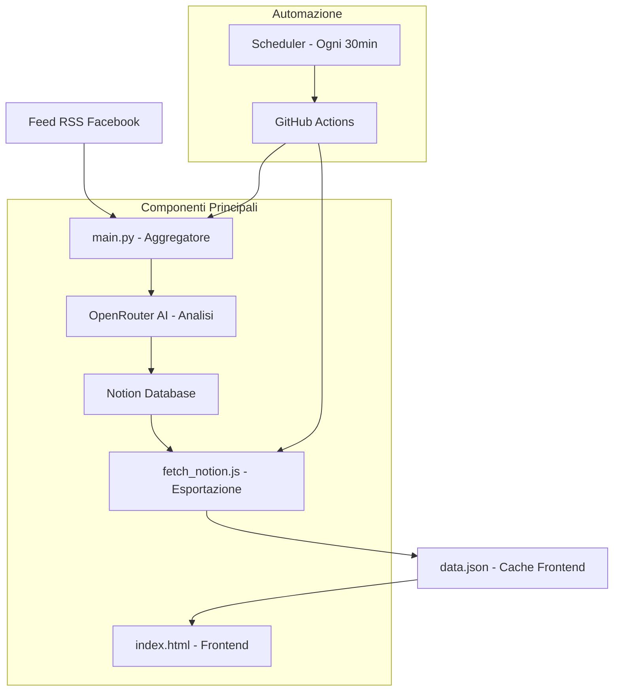

# 🏠 RoomRadar - Sistema Intelligente per Annunci Immobiliari

**RoomRadar** è un sistema automatizzato che aggrega, filtra e analizza annunci immobiliari da gruppi Facebook, utilizzando AI per valutare l'affidabilità e fornire un'interfaccia web moderna per la ricerca di alloggi a Barcellona.

   

## 📋 Indice

- [🎯 Panoramica](#-panoramica)
- [✨ Funzionalità Principali](#-funzionalità-principali)
- [🏗️ Architettura del Sistema](#️-architettura-del-sistema)
- [🚀 Installazione e Setup](#-installazione-e-setup)
- [⚙️ Configurazione](#️-configurazione)
- [🔄 Flusso di Lavoro Automatizzato](#-flusso-di-lavoro-automatizzato)
- [🤖 Integrazione AI](#-integrazione-ai)
- [🖼️ Sistema di Immagini](#️-sistema-di-immagini)
- [🌐 Frontend Interattivo](#-frontend-interattivo)
- [📊 Database e Gestione Dati](#-database-e-gestione-dati)
- [🔧 API e Integrazione](#-api-e-integrazione)
- [📱 Design Responsive](#-design-responsive)
- [🚨 Gestione Errori e Monitoraggio](#-gestione-errori-e-monitoraggio)
- [⚡ Performance e Ottimizzazioni](#-performance-e-ottimizzazioni)
- [🔒 Sicurezza e Privacy](#-sicurezza-e-privacy)
- [📈 Deployment e CI/CD](#-deployment-e-cicd)
- [🛠️ Sviluppo e Manutenzione](#️-sviluppo-e-manutenzione)
- [📄 Licenza](#-licenza)

## 🎯 Panoramica

RoomRadar risolve il problema della ricerca manuale di alloggi su Facebook automatizzando:

- **Aggregazione**: Raccolta automatica da feed RSS di gruppi Facebook
- **Filtraggio**: Eliminazione di spam, duplicati e annunci non pertinenti
- **Analisi AI**: Valutazione dell'affidabilità con scoring intelligente
- **Presentazione**: Interfaccia web moderna con filtri avanzati

### 🎪 Demo Live
👉 **[Visualizza RoomRadar](index.html)** *(apri il file nel browser)*

## ✨ Funzionalità Principali

### 🔍 **Ricerca Intelligente**
- **Filtri Avanzati**: Zona, prezzo, affidabilità, data di pubblicazione
- **Ordinamento**: Per data, rating, prezzo (crescente/decrescente)
- **Paginazione**: Navigazione fluida tra risultati
- **Ricerca in Tempo Reale**: Aggiornamento automatico dei risultati

### 🤖 **Analisi AI Automatica**
- **Scoring di Affidabilità**: Valutazione 1-5 stelle basata su contenuto e caratteristiche
- **Rilevamento Spam**: Eliminazione automatica di annunci non pertinenti
- **Riassunti Intelligenti**: Overview AI per annunci complessi
- **Deduplicazione**: Rimozione automatica di annunci duplicati

### 🖼️ **Gestione Immagini Avanzata**
- **Estrazione Automatica**: Dalle immagini nei post Facebook
- **Miniature Responsive**: Layout ottimizzato desktop/mobile
- **Lazy Loading**: Caricamento ottimizzato per performance
- **Fallback Graceful**: Gestione elegante di errori di caricamento

### 📊 **Dashboard Interattiva**
- **Statistiche Real-time**: Contatori e metriche aggiornate
- **Filtri Dinamici**: Interfaccia intuitiva per raffinare la ricerca
- **Design Moderno**: UI pulita e professionale
- **Accessibilità**: Supporto completo per screen reader e navigazione da tastiera

## 🏗️ Architettura del Sistema



### 📁 **Struttura del Progetto**
```
notion-rss-bot/
├── 📄 main.py                 # Core - Aggregazione e AI
├── 📄 censorship.py           # Modulo censura dati sensibili
├── 📄 zone_mapping.py         # Mappatura zone Barcellona
├── 🌐 index.html              # Frontend completo
├── 📁 scripts/
│   └── 📄 fetch_notion.js     # Esportazione dati
├── 📁 public/
│   └── 📄 data.json           # Cache dati frontend
├── 📁 .github/workflows/
│   └── 📄 update-data.yml     # CI/CD Pipeline
├── 📄 requirements.txt        # Dipendenze Python
├── 📄 package.json            # Dipendenze Node.js
└── 📄 rejected_urls_cache.json # Cache URL scartati
```

## 🚀 Installazione e Setup

### 📋 **Prerequisiti**
- Python 3.8+
- Node.js 16+
- Account Notion con API key
- Account OpenRouter per AI
- Repository GitHub (per automazione)

### ⬇️ **Installazione**

1. **Clone del Repository**
```bash
git clone https://github.com/your-username/notion-rss-bot.git
cd notion-rss-bot
```

2. **Setup Ambiente Python**
```bash
# Installa dipendenze Python
pip install -r requirements.txt

# Verifica installazione
python -c "import requests, feedparser; print('✅ Dipendenze Python OK')"
```

3. **Setup Ambiente Node.js**
```bash
# Installa dipendenze Node.js
npm install

# Verifica installazione
node -e "console.log('✅ Node.js OK')"
```

## ⚙️ Configurazione

### 🔐 **Variabili d'Ambiente**

Crea le seguenti variabili d'ambiente (GitHub Secrets per produzione):

```bash
# Notion Database
NOTION_API_KEY=secret_xxxxxxxxxxxxxxxxxxxxxxxxxxxxxxxxxxxxx
NOTION_DATABASE_ID=xxxxxxxxxxxxxxxxxxxxxxxxxxxxxxxx

# OpenRouter AI
OPENROUTER_API_KEY=sk-or-v1-xxxxxxxxxxxxxxxxxxxxxxxxxxxxxxxxxxxxx
```

### 🗄️ **Setup Database Notion**

1. **Crea Database Notion** con le seguenti proprietà:

| Nome Campo | Tipo | Descrizione |
|------------|------|-------------|
| `paraphrased_title` | Title | Titolo dell'annuncio |
| `overview` | Rich Text | Riassunto AI |
| `original_description` | Rich Text | Testo originale del post |
| `price` | Rich Text | Prezzo estratto |
| `zone` | Rich Text | Zona specifica |
| `zone_macro` | Rich Text | Zona macro (mappata) |
| `rooms` | Rich Text | Numero camere |
| `reliability` | Number | Rating 1-5 |
| `rating_reason` | Rich Text | Spiegazione del rating |
| `date_added` | Date | Data inserimento |
| `link` | URL | Link al post Facebook |
| `images` | URL | URL prima immagine |
| `Status` | Select | Attivo/Scaduto |

2. **Configura Select "Status"** con opzioni:
   - ✅ Attivo (verde)
   - ❌ Scaduto (rosso)

### 📍 **Mappatura Zone**

Il file `zone_mapping.py` contiene la mappatura delle zone di Barcellona:

```python
BARCELONA_MACRO_ZONES = {
    "Ciutat Vella": ["Barrio Gótico", "El Raval", "Born", "Barceloneta"],
    "Eixample": ["Eixample Esquerra", "Eixample Dreta", "Sagrada Familia"],
    "Gràcia": ["Vila de Gràcia", "Camp d'en Grassot"],
    # ... altre zone
}
```

Personalizza le zone secondo le tue esigenze.

## 🔄 Flusso di Lavoro Automatizzato

### ⏰ **Scheduling Automatico**

Il sistema si aggiorna automaticamente ogni 30 minuti tramite GitHub Actions:

```yaml
# .github/workflows/update-data.yml
on:
  schedule:
    - cron: '*/30 * * * *'  # Ogni 30 minuti
  workflow_dispatch:        # Trigger manuale
```

### 🔄 **Pipeline Completa**

1. **Aggregazione** (`main.py`)
   - Scarica feed RSS da gruppi Facebook
   - Estrae testo e immagini dai post
   - Pulisce HTML e normalizza contenuto

2. **Analisi AI** (OpenRouter + Llama 3.3)
   - Filtra annunci pertinenti vs spam
   - Estrae informazioni strutturate
   - Assegna rating di affidabilità
   - Genera riassunti intelligenti

3. **Storage** (Notion Database)
   - Salva dati strutturati
   - Gestisce deduplicazione
   - Mantiene storico e versioning

4. **Esportazione** (`fetch_notion.js`)
   - Esporta dati in formato JSON
   - Ottimizza per frontend
   - Aggiorna cache locale

5. **Frontend** (`index.html`)
   - Carica dati da cache JSON
   - Renderizza interfaccia interattiva
   - Gestisce filtri e ricerca

## 🤖 Integrazione AI

### 🧠 **Modello AI**
- **Provider**: OpenRouter
- **Modello**: Meta Llama 3.3 70B Instruct (gratuito)
- **Funzione**: Analisi e filtraggio annunci

### 📝 **Prompt Engineering**

Il sistema utilizza prompt strutturati per:

```python
PROMPT_TEMPLATE = """
Analyze these posts from Facebook groups for rentals in Barcelona.

For each post, determine:
1. Is it a relevant rental listing? (YES/NO)
2. Extract: title, price, zone, rooms, description
3. Assign reliability rating (1-5) based on:
   - Presence of photos
   - Complete information
   - Contatti disponibili
   - Assenza di segnali di spam

Formato output: JSON strutturato
"""
```

### 🎯 **Criteri di Valutazione**

L'AI valuta l'affidabilità basandosi su:

- ✅ **Presenza di immagini** (+1-2 punti)
- ✅ **Informazioni complete** (prezzo, zona, contatti)
- ✅ **Descrizione dettagliata** 
- ✅ **Contatti verificabili** (telefono, WhatsApp)
- ❌ **Segnali di spam** (prezzi irrealistici, testo sospetto)

## 🖼️ Sistema di Immagini

### 📥 **Estrazione Automatica**

Il sistema estrae immagini da:
- Tag `` nell'HTML dei post
- Media content RSS (`media:content`)
- Decodifica automatica entità HTML

```python
def extract_all_images(entry):
    """Estrae tutte le immagini da un entry RSS"""
    desc_images = extract_images_from_description(entry.description)
    media_images = extract_images_from_media_content(entry)
    return list(set(desc_images + media_images))  # Rimuove duplicati
```

### 🎨 **Layout Responsive**

#### 🖥️ **Desktop**
- Miniatura posizionata in alto a destra (120x90px)
- Posizionamento assoluto per non interferire con il contenuto
- Visibile solo per post con immagini

#### 📱 **Mobile** 
- Miniatura a tutta larghezza in cima (150px altezza)
- Layout verticale ottimizzato
- Nascosta completamente per post senza immagini

### ⚡ **Ottimizzazioni Performance**

- **Lazy Loading**: `loading="lazy"` per caricamento ottimizzato
- **Error Handling**: Fallback graceful per immagini non disponibili
- **Caching**: Nessuna ridondanza, utilizzo diretto dei link Facebook

## 🌐 Frontend Interattivo

### 🎨 **Design System**

#### 🎨 **Palette Colori**
```css
:root {
  --primary: #007AFF;      /* Blu Apple */
  --secondary: #5856D6;    /* Viola */
  --success: #388e3c;      /* Verde */
  --warning: #f57c00;      /* Arancione */
  --danger: #dc2626;       /* Rosso */
  --background: #ffffff;   /* Bianco */
  --surface: #f8fafc;      /* Grigio chiaro */
  --text: #1d1d1f;         /* Nero Apple */
  --text-secondary: #86868b; /* Grigio */
}
```

#### 📱 **Responsive Breakpoints**
- **Desktop**: > 768px
- **Mobile**: ≤ 768px
- **Layout fluido** con CSS Grid e Flexbox

### 🔍 **Funzionalità Ricerca**

#### 🎛️ **Filtri Disponibili**
- **Zona**: Dropdown con zone mappate
- **Affidabilità Minima**: Slider 1-5 stelle
- **Prezzo Massimo**: Input numerico
- **Data Pubblicazione**: Oggi, 3 giorni, settimana, mese

#### 📊 **Ordinamento**
- Data (più recenti/vecchi)
- Rating (più alto/basso)  
- Prezzo (crescente/decrescente)

#### 📄 **Paginazione**
- Risultati per pagina: 10, 20, 50, 100
- Navigazione numerata
- Pulsanti Prima/Ultima

### 🎯 **Interazioni Utente**

#### ✨ **Micro-interazioni**
- Hover effects su card e pulsanti
- Transizioni fluide (0.2s ease)
- Loading states per immagini
- Focus states per accessibilità

#### 📱 **Touch-friendly**
- Pulsanti dimensione minima 44px
- Gesture swipe per mobile
- Tap targets ottimizzati

## 📊 Database e Gestione Dati

### 🗄️ **Schema Notion**

Il database Notion funge da source of truth con:

```javascript
// Struttura record
{
  id: "uuid",
  title: "Titolo annuncio",
  overview: "Riassunto AI",
  description: "Testo originale",
  price: "€500",
  zone: "Gràcia",
  zoneMacro: "Gràcia",
  rooms: "1",
  reliability: 4,
  reliabilityReason: "Foto presente, contatti disponibili",
  dateAdded: "2025-01-20T10:30:00.000Z",
  link: "https://facebook.com/...",
  imageUrl: "https://scontent.fxx.fbcdn.net/...",
  status: "Attivo"
}
```

### 🔄 **Sincronizzazione Dati**

#### 📥 **Import (main.py)**
- Polling feed RSS ogni 30 minuti
- Deduplicazione basata su similarità testo (fuzzy matching)
- Cache URL scartati per evitare riprocessing

#### 📤 **Export (fetch_notion.js)**
- Esportazione completa database → JSON
- Paginazione automatica (100 record/batch)
- Ottimizzazione per frontend

#### 💾 **Caching Strategy**
- Cache locale `public/data.json` per frontend
- Cache URL scartati `rejected_urls_cache.json`
- TTL 48h per URL scartati

### 🔍 **Deduplicazione Intelligente**

```python
def similarity_score(text1, text2):
    """Calcola similarità tra due testi usando fuzzy matching"""
    # Normalizzazione testo
    norm1 = normalize_text(text1)
    norm2 = normalize_text(text2)
    
    # Calcolo similarità
    return fuzz.ratio(norm1, norm2) / 100.0

# Soglia duplicati: 80% similarità
DUPLICATE_THRESHOLD = 0.8
```

## 🔧 API e Integrazione

### 🔌 **API Utilizzate**

#### 📊 **Notion API**
```javascript
// Configurazione
const NOTION_API_VERSION = "2022-06-28";
const BASE_URL = "https://api.notion.com/v1";

// Headers standard
const headers = {
  "Authorization": `Bearer ${NOTION_API_KEY}`,
  "Content-Type": "application/json",
  "Notion-Version": NOTION_API_VERSION
};
```

#### 🤖 **OpenRouter API**
```python
# Configurazione
OPENROUTER_URL = "https://openrouter.ai/api/v1/chat/completions"
MODEL_NAME = "meta-llama/llama-3.3-70b-instruct:free"

# Rate limiting
MAX_BATCH = 5        # Post per batch
MIN_BATCH = 1        # Batch minimo
INITIAL_BACKOFF = 2  # Secondi backoff iniziale
MAX_BACKOFF = 30     # Backoff massimo
```

### 🔄 **Gestione Rate Limiting**

```python
def call_openrouter(posts_batch, max_retries=3):
    """Chiama API con retry automatico e backoff esponenziale"""
    current_backoff = INITIAL_BACKOFF
    
    for attempt in range(max_retries):
        try:
            response = requests.post(url, headers=headers, json=payload)
            
            if response.status_code == 429:  # Rate limited
                time.sleep(current_backoff)
                current_backoff = min(current_backoff * 2, MAX_BACKOFF)
                continue
                
            return response.json()
            
        except Exception as e:
            if attempt < max_retries - 1:
                time.sleep(current_backoff)
                current_backoff = min(current_backoff * 2, MAX_BACKOFF)
    
    return None
```

## 📱 Design Responsive

### 🖥️ **Layout Desktop**

```css
.card {
  display: flex;
  gap: 1rem;
  position: relative;
}

.card-thumbnail-desktop {
  position: absolute;
  top: 1.5rem;
  right: 1.5rem;
  width: 120px;
  height: 90px;
}
```

### 📱 **Layout Mobile**

```css
@media (max-width: 768px) {
  .card {
    flex-direction: column;
    gap: 0.75rem;
  }
  
  .card-thumbnail-desktop {
    display: none; /* Nasconde miniatura desktop */
  }
  
  .card-thumbnail {
    width: 100%;
    height: 150px;
    order: -1; /* In cima */
  }
}
```

### ♿ **Accessibilità (WCAG 2.1)**

- **Keyboard Navigation**: Tab, Enter, Space per navigazione
- **Screen Readers**: ARIA labels e semantic HTML
- **Focus Indicators**: Outline visibile per focus
- **Color Contrast**: Minimo 4.5:1 per testo normale
- **Alt Text**: Descrittivo per tutte le immagini

```html
<!-- Esempio accessibilità -->
<div class="card-thumbnail" 
     role="button" 
     tabindex="0" 
     aria-label="Apri annuncio: Stanza in Gràcia"
     onkeydown="if(event.key==='Enter'||event.key===' ')openListing()">
```

## 🚨 Gestione Errori e Monitoraggio

### 🔍 **Logging Strutturato**

```python
# Logging con emoji per facilità lettura
print(f"✅ Aggiunto su Notion: {title}")
print(f"❌ Errore API OpenRouter: {error}")
print(f"⏳ Rate limit raggiunto, attendo {backoff}s...")
print(f"🖼️ Trovate {len(images)} immagini per: {title}")
```

### 🚨 **Gestione Errori**

#### 🌐 **Errori Network**
- Retry automatico con backoff esponenziale
- Timeout configurabili
- Fallback per servizi non disponibili

#### 🤖 **Errori AI**
- Validazione response JSON
- Fallback per parsing fallito
- Skip batch problematici

#### 💾 **Errori Database**
- Transazioni atomiche
- Rollback automatico
- Logging dettagliato errori

### 📊 **Metriche e Monitoraggio**

Il sistema traccia:
- **Post processati** per sessione
- **Tasso di successo** AI analysis
- **Duplicati rilevati** e scartati
- **Errori per categoria** (network, AI, database)
- **Performance timing** per ogni fase

## ⚡ Performance e Ottimizzazioni

### 🚀 **Ottimizzazioni Backend**

#### 💾 **Caching Intelligente**
```python
# Cache in memoria per performance
_similarity_cache = {}        # Cache calcoli similarità
_text_normalization_cache = {}  # Cache normalizzazione testo
_cache_data = None            # Cache file rejected URLs

def clear_caches():
    """Pulisce cache per evitare memory leak"""
    if len(_similarity_cache) > 1000:
        _similarity_cache.clear()
```

#### 🔄 **Batch Processing**
- Elaborazione batch per API calls
- Riduzione automatica batch size in caso di rate limiting
- Parallelizzazione quando possibile

#### 📊 **Database Optimization**
- Paginazione per query grandi (100 record/batch)
- Indici su campi di ricerca frequenti
- Lazy loading per dati non critici

### 🌐 **Ottimizzazioni Frontend**

#### 🖼️ **Immagini**
```html
<!-- Lazy loading nativo -->


<!-- Prevenzione layout shift -->
<div style="width: 120px; height: 90px;">
  
</div>
```

#### 📦 **Bundle Optimization**
- CSS e JS inline per ridurre HTTP requests
- Minificazione automatica in produzione
- Compressione gzip/brotli

#### 💾 **Caching Strategy**
```html
<!-- Cache busting -->
<meta http-equiv="Cache-Control" content="no-cache, no-store, must-revalidate">

<!-- Timestamp per evitare cache stale -->
const response = await fetch("public/data.json?t=" + Date.now());
```

## 🔒 Sicurezza e Privacy

### 🔐 **Gestione Secrets**

```yaml
# GitHub Secrets (production)
NOTION_API_KEY: ${{ secrets.NOTION_API_KEY }}
NOTION_DATABASE_ID: ${{ secrets.NOTION_DATABASE_ID }}
OPENROUTER_API_KEY: ${{ secrets.OPENROUTER_API_KEY }}
```

### 🛡️ **Sicurezza Dati**

#### 🔒 **Privacy by Design**
- **Nessun dato personale** salvato oltre a quello pubblico
- **Link esterni** per immagini (no hosting diretto)
- **Censura automatica** di dati sensibili

#### 🚫 **Censura Dati Sensibili**

Il sistema include un modulo avanzato di censura (`censorship.py`) che protegge automaticamente la privacy degli utenti:

**Dati censurati automaticamente**:
- ✅ **Numeri di telefono** (italiani: +39 3xx xxx xxxx, spagnoli: +34 6xx xxx xxx)
- ✅ **Contatti WhatsApp/Telegram** (riconoscimento contestuale)
- ✅ **Indirizzi email** (formato standard)
- ✅ **Codici fiscali** italiani (16 caratteri alfanumerici)
- ✅ **Partite IVA** (11 cifre, esclusi numeri di telefono)

**Dati preservati** (utili per identificare zone):
- ✅ **Indirizzi fisici** (via, piazza, quartieri)
- ✅ **Nomi di zone** (necessari per il mapping)
- ✅ **Informazioni geografiche** (metro, trasporti)

```python
# Esempio di censura
original = "Chiamami al 333-123-4567 o WhatsApp 612345678"
censored = "[PHONE NUMBER CENSORED] or [MESSAGING CONTACT CENSORED]"
```

**Architettura di censura**:
```python
# censorship.py - Modulo dedicato
class DataCensor:
    def censor_text(self, text: str) -> str:
        """Censura dati sensibili mantenendo informazioni geografiche"""
        # Pattern avanzati per riconoscimento contestuale
        # Output in inglese per standardizzazione
        return censored_text
```

**Integrazione seamless**:
- 🔄 **Censura centralizzata** in un unico punto del pipeline
- 📊 **Statistiche dettagliate** sui tipi di dati censurati
- 🚀 **Performance ottimizzate** con caching intelligente
- 🌐 **Output multilingua** (inglese per standardizzazione)

#### 🚫 **Prevenzione Abuse**
- Rate limiting su API calls
- Validazione input utente
- Sanitizzazione HTML content

#### 🔍 **Audit Trail**
- Logging di tutte le operazioni critiche
- Timestamp per tracking modifiche
- Versioning implicito tramite Notion
- **Log censura** per trasparenza

### 🌐 **GDPR Compliance**

- **Dati pubblici**: Solo contenuti già pubblici su Facebook
- **Diritto all'oblio**: Rimozione automatica post scaduti
- **Trasparenza**: Codice open source per audit
- **Privacy by design**: Censura automatica dati sensibili

## 📈 Deployment e CI/CD

### 🚀 **GitHub Actions Workflow**

```yaml
name: Update RoomRadar Data

on:
  schedule:
    - cron: '*/30 * * * *'  # Ogni 30 minuti
  workflow_dispatch:         # Trigger manuale

jobs:
  update-data:
    runs-on: ubuntu-latest
    steps:
      - name: Checkout
        uses: actions/checkout@v4
        
      - name: Setup Python
        uses: actions/setup-python@v4
        with:
          python-version: '3.11'
          
      - name: Install dependencies
        run: pip install -r requirements.txt
        
      - name: Run RSS aggregation
        run: python main.py
        env:
          NOTION_API_KEY: ${{ secrets.NOTION_API_KEY }}
          NOTION_DATABASE_ID: ${{ secrets.NOTION_DATABASE_ID }}
          OPENROUTER_API_KEY: ${{ secrets.OPENROUTER_API_KEY }}
          
      - name: Setup Node.js
        uses: actions/setup-node@v4
        with:
          node-version: '18'
          
      - name: Export Notion data
        run: node scripts/fetch_notion.js
        env:
          NOTION_API_KEY: ${{ secrets.NOTION_API_KEY }}
          NOTION_DATABASE_ID: ${{ secrets.NOTION_DATABASE_ID }}
          
      - name: Commit and push
        run: |
          git config --local user.email "action@github.com"
          git config --local user.name "GitHub Action"
          git add public/data.json rejected_urls_cache.json
          git commit -m "🔄 Aggiornamento automatico dati $(date '+%Y-%m-%d %H:%M')" || exit 0
          git push
```

### 🌐 **Hosting Options**

#### 🆓 **GitHub Pages** (Consigliato)
```yaml
# Aggiungi al workflow
- name: Deploy to GitHub Pages
  uses: peaceiris/actions-gh-pages@v3
  with:
    github_token: ${{ secrets.GITHUB_TOKEN }}
    publish_dir: ./
```

#### ☁️ **Alternative Hosting**
- **Netlify**: Deploy automatico da Git
- **Vercel**: Ottimizzato per frontend
- **Firebase Hosting**: Google Cloud
- **AWS S3 + CloudFront**: Scalabilità enterprise

### 📊 **Monitoring e Alerting**

```yaml
# Aggiungi notifiche Discord/Slack
- name: Notify on failure
  if: failure()
  uses: 8398a7/action-slack@v3
  with:
    status: failure
    text: "❌ RoomRadar update failed"
```

## 🛠️ Sviluppo e Manutenzione

### 🔧 **Setup Ambiente di Sviluppo**

```bash
# Clone e setup
git clone https://github.com/your-username/notion-rss-bot.git
cd notion-rss-bot

# Setup Python environment
python -m venv venv
source venv/bin/activate  # Linux/Mac
# venv\Scripts\activate   # Windows

pip install -r requirements.txt

# Setup Node.js
npm install

# Test locale
python main.py  # Richiede variabili d'ambiente
node scripts/fetch_notion.js
open index.html  # Apri nel browser
```

### 🧪 **Testing**

#### 🔍 **Test Manuali**
```bash
# Test aggregazione RSS
python -c "
import main
feeds = main.process_rss()
print(f'✅ Processati {len(feeds)} feed')
"

# Test esportazione
node scripts/fetch_notion.js
echo "✅ Export completato"

# Test frontend
python -m http.server 8000
# Apri http://localhost:8000
```

#### 🤖 **Test Automatici**
```python
# Aggiungi test unitari
def test_extract_images():
    html = ''
    images = extract_images_from_description(html)
    assert len(images) == 1
    assert images[0] == "test.jpg"
```

### 🔄 **Workflow di Sviluppo**

1. **Feature Branch**: `git checkout -b feature/nome-feature`
2. **Sviluppo**: Implementa e testa localmente
3. **Test**: Verifica funzionalità end-to-end
4. **Pull Request**: Code review e merge
5. **Deploy**: Automatico via GitHub Actions

### 📝 **Customizzazione**

#### 🎨 **Personalizzazione UI**
```css
/* Personalizza colori in index.html */
:root {
  --primary: #your-color;
  --secondary: #your-secondary;
}
```

#### 📍 **Aggiungere Zone**
```python
# Modifica zone_mapping.py
BARCELONA_MACRO_ZONES = {
    "Nuova Zona": ["Sottosona 1", "Sottosona 2"],
    # ... altre zone
}
```

#### 🤖 **Personalizzazione AI**
```python
# Modifica prompt in main.py
PROMPT_TEMPLATE = """
Il tuo prompt personalizzato per l'AI...
Analizza questi post secondo i tuoi criteri...
"""
```

## 🌍 **Adattamento per Altre Città**

### 🎯 **Panoramica del Processo**

Adattare RoomRadar per una nuova città richiede modifiche in **5 aree principali**:

1. **Configurazione Feed RSS** - Nuovi gruppi Facebook
2. **Mappatura Zone** - Zone della nuova città
3. **Personalizzazione UI** - Titolo, colori, branding
4. **Ottimizzazione AI** - Prompt specifici per la città
5. **Deployment** - Nuovo repository e configurazione

### 📋 **Checklist Completa**

#### 🔗 **1. Feed RSS e Gruppi Facebook**

**File da modificare**: `main.py`

```python
# Trova e sostituisci i feed RSS
RSS_FEEDS = [
    "https://www.facebook.com/feeds/page.php?id=GROUP_ID&format=rss20",
    "https://www.facebook.com/feeds/page.php?id=ANOTHER_GROUP_ID&format=rss20",
    # Aggiungi tutti i gruppi Facebook della nuova città
]

# Esempio per Milano:
RSS_FEEDS = [
    "https://www.facebook.com/feeds/page.php?id=123456789&format=rss20",  # Affitti Milano
    "https://www.facebook.com/feeds/page.php?id=987654321&format=rss20",  # Case Milano
    "https://www.facebook.com/feeds/page.php?id=456789123&format=rss20",  # Stanze Milano
]
```

**Come trovare i feed RSS**:
1. Vai su un gruppo Facebook
2. Aggiungi `/rss` all'URL: `facebook.com/groups/GROUP_ID/rss`
3. Oppure usa: `facebook.com/feeds/page.php?id=GROUP_ID&format=rss20`

#### 🗺️ **2. Mappatura Zone della Città**

**File da modificare**: `zone_mapping.py`

```python
# Sostituisci completamente il contenuto
MILANO_MACRO_ZONES = {
    "Centro Storico": ["Duomo", "Brera", "Navigli", "Porta Romana"],
    "Zona Nord": ["Porta Nuova", "Isola", "Corso Como", "Porta Garibaldi"],
    "Zona Sud": ["Porta Ticinese", "Darsena", "Porta Genova", "Navigli"],
    "Zona Est": ["Città Studi", "Lambrate", "Porta Venezia", "Porta Vittoria"],
    "Zona Ovest": ["Porta Magenta", "Porta Vercellina", "San Siro", "Fiera"],
    "Periferia": ["Bicocca", "Sesto San Giovanni", "Cologno Monzese", "Segrate"]
}

# Aggiorna anche la funzione di mappatura
def map_zone_to_macro_zone(zone):
    """Mappa zone specifiche a macro zone di Milano"""
    zone_lower = zone.lower().strip()
    
    for macro_zone, sub_zones in MILANO_MACRO_ZONES.items():
        for sub_zone in sub_zones:
            if sub_zone.lower() in zone_lower or zone_lower in sub_zone.lower():
                return macro_zone
    
    return zone  # Ritorna la zona originale se non trovata
```

**Esempi per altre città**:

**Roma**:
```python
ROMA_MACRO_ZONES = {
    "Centro Storico": ["Trastevere", "Campo de' Fiori", "Piazza Navona", "Pantheon"],
    "Zona Nord": ["Parioli", "Flaminio", "Salario", "Nomentano"],
    "Zona Sud": ["Testaccio", "Ostiense", "Garbatella", "San Paolo"],
    "Zona Est": ["Pigneto", "Torpignattara", "Centocelle", "Tuscolano"],
    "Zona Ovest": ["Monteverde", "Gianicolense", "Aurelio", "Balduina"]
}
```

**Firenze**:
```python
FIRENZE_MACRO_ZONES = {
    "Centro Storico": ["Duomo", "Ponte Vecchio", "Piazza della Signoria", "Oltrarno"],
    "Zona Nord": ["Novoli", "Rifredi", "Careggi", "Le Cure"],
    "Zona Sud": ["Gavinana", "Porta Romana", "San Frediano", "San Niccolò"],
    "Zona Est": ["Campo di Marte", "Coverciano", "Bellariva", "Rovezzano"]
}
```

#### 🎨 **3. Personalizzazione Frontend**

**File da modificare**: `index.html`

```html
<!-- 1. Cambia il titolo -->
<title>RoomRadar Milano - Beta test</title>

<!-- 2. Aggiorna header -->
<h1>RoomRadar Milano</h1>
<p class="header-subtitle">Beta Test - Milano</p>

<!-- 3. Personalizza colori (opzionale) -->
<style>
:root {
  --primary: #e74c3c;      /* Rosso Milano */
  --secondary: #2c3e50;    /* Blu scuro */
  --accent: #f39c12;       /* Arancione */
}
</style>

<!-- 4. Aggiorna meta description -->
<meta name="description" content="RoomRadar Milano - Trova alloggi a Milano con AI">
```

**Esempi di personalizzazione per città**:

**Milano** (Rosso/Blu):
```css
:root {
  --primary: #e74c3c;      /* Rosso Milano */
  --secondary: #2c3e50;    /* Blu scuro */
  --accent: #f39c12;       /* Arancione */
}
```

**Roma** (Giallo/Oro):
```css
:root {
  --primary: #f1c40f;      /* Giallo Roma */
  --secondary: #8b4513;    /* Marrone */
  --accent: #e67e22;       /* Arancione */
}
```

**Firenze** (Verde/Rosso):
```css
:root {
  --primary: #27ae60;      /* Verde Firenze */
  --secondary: #c0392b;    /* Rosso */
  --accent: #f39c12;       /* Arancione */
}
```

#### 🤖 **4. Ottimizzazione AI per la Città**

**File da modificare**: `main.py`

```python
# 1. Aggiorna il prompt per la nuova città
PROMPT_TEMPLATE = """
Analizza questi post da gruppi Facebook di affitti a MILANO.

Per ogni post, determina:
1. È un annuncio di affitto pertinente per MILANO? (SI/NO)
2. Estrai: titolo, prezzo, zona, camere, descrizione
3. Assegna rating affidabilità (1-5) basato su:
   - Presenza di foto
   - Informazioni complete
   - Contatti disponibili
   - Assenza di segnali di spam
   - Prezzi realistici per MILANO

Formato output: JSON strutturato
"""

# 2. Aggiorna la funzione di mappatura zone
from zone_mapping import map_zone_to_macro_zone

# 3. Personalizza i criteri di valutazione per la città
def evaluate_reliability_for_city(post_data, city="Milano"):
    """Valutazione specifica per città"""
    base_score = 0
    
    # Criteri specifici per Milano
    if city == "Milano":
        if "metro" in post_data.get("description", "").lower():
            base_score += 1  # Bonus per vicinanza metro
        if "centrale" in post_data.get("zone", "").lower():
            base_score += 1  # Bonus per zone centrali
    
    return min(base_score, 5)  # Max 5 stelle
```

#### 🔧 **5. Aggiornamento Script di Esportazione**

**File da modificare**: `scripts/fetch_notion.js`

```javascript
// Aggiorna il nome del database se necessario
const DB_ID = process.env.NOTION_DATABASE_ID; // Nuovo database per la città

// Personalizza il nome del file di output
const outPath = path.join(outDir, "data.json"); // Mantieni stesso nome per compatibilità

// Aggiorna logging
console.log(`Scritto ${outPath} con ${mapped.length} record per Milano`);
```

#### 🚀 **6. Setup Nuovo Database Notion**

1. **Crea nuovo database** in Notion con stessa struttura
2. **Aggiorna variabili d'ambiente**:
```bash
# Nuove variabili per la città
NOTION_API_KEY=your_api_key
NOTION_DATABASE_ID=new_database_id_for_city
OPENROUTER_API_KEY=your_openrouter_key
```

3. **Configura proprietà database** (stesse del template originale)

#### 📁 **7. Struttura Repository per Multi-Città**

**Opzione A: Repository Separati**
```
roomradar-milano/
roomradar-roma/
roomradar-firenze/
```

**Opzione B: Repository Unico con Branch**
```bash
git checkout -b milano
git checkout -b roma
git checkout -b firenze
```

**Opzione C: Configurazione Dinamica**
```python
# config.py
CITY_CONFIG = {
    "milano": {
        "name": "Milano",
        "feeds": [...],
        "zones": MILANO_MACRO_ZONES,
        "colors": {"primary": "#e74c3c", ...}
    },
    "roma": {
        "name": "Roma", 
        "feeds": [...],
        "zones": ROMA_MACRO_ZONES,
        "colors": {"primary": "#f1c40f", ...}
    }
}
```

### 🔄 **Processo di Migrazione Step-by-Step**

#### 📋 **Fase 1: Preparazione (30 min)**
1. **Fork/Clone** repository originale
2. **Crea nuovo database** Notion per la città
3. **Identifica gruppi Facebook** locali
4. **Raccogli zone** della città

#### 🔧 **Fase 2: Modifiche Codice (1-2 ore)**
1. **Aggiorna feed RSS** in `main.py`
2. **Crea mappatura zone** in `zone_mapping.py`
3. **Personalizza frontend** in `index.html`
4. **Ottimizza prompt AI** per la città
5. **Testa localmente** le modifiche

#### ⚙️ **Fase 3: Configurazione (30 min)**
1. **Setup variabili d'ambiente**
2. **Configura GitHub Actions**
3. **Testa pipeline completa**
4. **Verifica frontend**

#### 🚀 **Fase 4: Deployment (15 min)**
1. **Push su GitHub**
2. **Configura GitHub Pages**
3. **Testa produzione**
4. **Monitora primo aggiornamento**

### 🎯 **Esempi Pratici per Città Specifiche**

#### 🏛️ **Roma - Configurazione Completa**

**Feed RSS**:
```python
RSS_FEEDS = [
    "https://www.facebook.com/feeds/page.php?id=123456789&format=rss20",  # Affitti Roma
    "https://www.facebook.com/feeds/page.php?id=987654321&format=rss20",  # Case Roma Centro
    "https://www.facebook.com/feeds/page.php?id=456789123&format=rss20",  # Stanze Roma
]
```

**Zone Roma**:
```python
ROMA_MACRO_ZONES = {
    "Centro Storico": ["Trastevere", "Campo de' Fiori", "Piazza Navona", "Pantheon", "Via del Corso"],
    "Zona Nord": ["Parioli", "Flaminio", "Salario", "Nomentano", "Villa Borghese"],
    "Zona Sud": ["Testaccio", "Ostiense", "Garbatella", "San Paolo", "Eur"],
    "Zona Est": ["Pigneto", "Torpignattara", "Centocelle", "Tuscolano", "Cinecittà"],
    "Zona Ovest": ["Monteverde", "Gianicolense", "Aurelio", "Balduina", "Vaticano"]
}
```

**Frontend Roma**:
```html
<title>RoomRadar Roma - Trova alloggi nella Città Eterna</title>
<h1>RoomRadar Roma</h1>
<p class="header-subtitle">Beta Test - Roma</p>
```

#### 🏙️ **Milano - Configurazione Completa**

**Feed RSS**:
```python
RSS_FEEDS = [
    "https://www.facebook.com/feeds/page.php?id=111222333&format=rss20",  # Affitti Milano
    "https://www.facebook.com/feeds/page.php?id=444555666&format=rss20",  # Case Milano Centro
    "https://www.facebook.com/feeds/page.php?id=777888999&format=rss20",  # Stanze Milano
]
```

**Zone Milano**:
```python
MILANO_MACRO_ZONES = {
    "Centro Storico": ["Duomo", "Brera", "Navigli", "Porta Romana", "Via Torino"],
    "Zona Nord": ["Porta Nuova", "Isola", "Corso Como", "Porta Garibaldi", "Centrale"],
    "Zona Sud": ["Porta Ticinese", "Darsena", "Porta Genova", "Navigli", "Colonne"],
    "Zona Est": ["Città Studi", "Lambrate", "Porta Venezia", "Porta Vittoria", "Corso Buenos Aires"],
    "Zona Ovest": ["Porta Magenta", "Porta Vercellina", "San Siro", "Fiera", "Corso Vercelli"],
    "Periferia": ["Bicocca", "Sesto San Giovanni", "Cologno Monzese", "Segrate", "San Donato"]
}
```

### ⚠️ **Considerazioni Importanti**

#### 🌍 **Differenze Regionali**
- **Terminologia**: "Stanza" vs "Camera" vs "Habitación"
- **Prezzi**: Range molto diversi tra città
- **Zone**: Importanza diversa delle zone centrali
- **Trasporti**: Metro vs bus vs tram

#### 🔍 **Ottimizzazioni Specifiche**
- **Milano**: Focus su metro e zone business
- **Roma**: Importanza centro storico e trasporti
- **Firenze**: Zone universitarie e turistiche
- **Napoli**: Zone costiere e centro storico

#### 📊 **Monitoraggio e Analytics**
- **Tasso di successo** per città
- **Zone più popolari** per ricerca
- **Range prezzi** tipici
- **Performance AI** per città specifica

### 🎉 **Benefici del Multi-City Setup**

- ✅ **Scalabilità**: Facile aggiungere nuove città
- ✅ **Personalizzazione**: Ottimizzato per ogni contesto locale
- ✅ **Manutenibilità**: Codice base condiviso
- ✅ **Analytics**: Confronti tra città
- ✅ **Monetizzazione**: Possibilità di espansione commerciale

### 🐛 **Troubleshooting**

#### ❌ **Errori Comuni**

**"Mancano variabili d'ambiente"**
```bash
# Verifica variabili
echo $NOTION_API_KEY
echo $NOTION_DATABASE_ID  
echo $OPENROUTER_API_KEY
```

**"Rate limit OpenRouter"**
- Riduci `MAX_BATCH` in `main.py`
- Aumenta `INITIAL_BACKOFF_SECONDS`

**"Errore Notion API"**
- Verifica permissions database
- Controlla formato `NOTION_DATABASE_ID`

**"Frontend non carica dati"**
- Verifica esistenza `public/data.json`
- Controlla console browser per errori
- Testa con server locale

#### 📞 **Support**

Per supporto tecnico:
1. Controlla [Issues GitHub](https://github.com/your-username/notion-rss-bot/issues)
2. Crea nuovo issue con:
   - Descrizione problema
   - Log errori
   - Passi per riprodurre
   - Ambiente (OS, versioni)


---

## 🎉 Conclusione

**RoomRadar** rappresenta una soluzione completa e moderna per l'aggregazione intelligente di annunci immobiliari, combinando:

- 🤖 **AI avanzata** per filtraggio e analisi
- 🎨 **Design moderno** e responsive
- ⚡ **Performance ottimizzate** 
- 🔒 **Sicurezza e privacy** by design
- 🚀 **Deployment automatizzato**

Il sistema è **production-ready** e facilmente personalizzabile per diverse città o tipologie di annunci.

---

### 🌟 **Contribuisci al Progetto**

RoomRadar è open source! Contributi benvenuti:

- 🐛 **Bug reports** e **feature requests**
- 💡 **Miglioramenti** e **ottimizzazioni**  
- 📖 **Documentazione** e **traduzioni**
- 🧪 **Test** e **quality assurance**

**Happy house hunting! 🏠✨**
